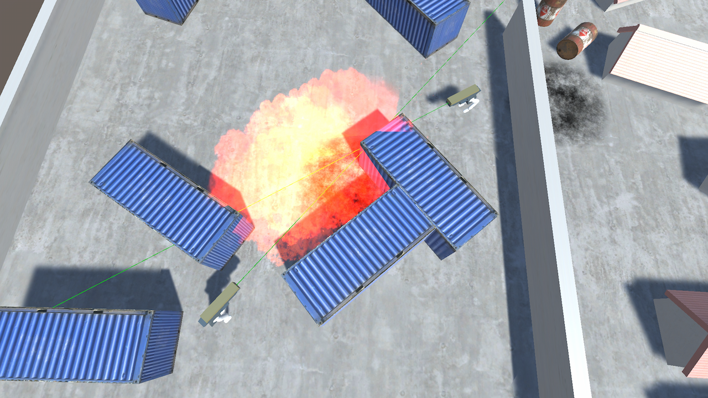

# *Guns with Legs*

*Coding Night* du 08/02/2020

---------------------------

Controles J1 :

ZQSD : Déplacement
Espace : Tir

Controles J2 :
Fléches directionnelles : Déplacement
M : Tir

---------------------------

Lien dépot git : https://github.com/TeleGD/tgd-guns-with-legs